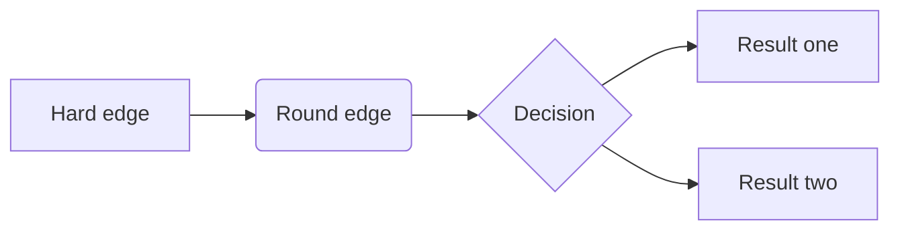

# quarto features

## Citations

- Citation: Wickham ([2014](#ref-JSSv059i10))

## Code annotations

``` r
library(tidyverse)
library(palmerpenguins)
1penguins |>
2  mutate(
    bill_ratio = bill_depth_mm / bill_length_mm,
    bill_area  = bill_depth_mm * bill_length_mm
  )
```

- 1:

  Take `penguins`, and then,

- 2:

  add new columns for the bill ratio and bill area.

## Code filename

    matplotlib.py

``` python
import matplotlib.pyplot as plt
plt.plot([1,23,2,4])
plt.show()
```

## Callout Blocks

Note

Note that there are five types of callouts, including: `note`,`tip`,
`warning`, `caution` and `important`.

Warning

Callouts provide a simple way to attract attention, for example, to this
warning.

Important

The callout heading is provided by the callout type, with the expected
heading (i.e., Note, Warning, Important, Tip, or Caution).

Tip With Title

This is an example of a callout with a title. Providing a callout
heading is optional.

Caution

This is an example of a caution.

Simple

A simple callout.

NoteNo Icon

No icon

## Diagrams



## HTML widgets

## Keyboard

- Keyboard shortcut: Shift-Ctrl-PShift-Ctrl-P

## Lists

- item 2

  Continued (indent 4 spaces)

Another example

1.  ordered list

2.  item 2

    ``` python
    print("Hello, World!")
    ```

    1.  sub-sub-item 1

A task list

Task 1

Task 2

A definition

- term:

  definition

## Footnotes

Here is a footnote reference,[¹](#fn1) and another.[²](#fn2)

This paragraph won’t be part of the note, because it isn’t indented.

Here is an inline note.[³](#fn3)

## Equations

inline math: $E = mc^{2}$

display math:

$$E = mc^{2}$$

## Other blocks

Line Block  
  Spaces and newlines  
  are preserved

THIS TEXT IS SMALLCAPS

*This text is underlined*

This text is highlighted

endash: –

emdash: —

## Shortcodes

The subtitle of this document is as follows: Using this for shortcodes

![](data:image/png;base64,iVBORw0KGgoAAAANSUhEUgAAAZAAAADICAYAAADGFbfiAAAIcklEQVR4nO3csZYM6xrH4XIBuAAyESIJIhJEJGQkIyMhIiIiIiIhMwkZCRESIiQkiES4AFyAU/92vq2mTvXM7HfRM2et50l099RUfz1rr/fXX/XM3vLp06efHQD8SwICQImAAFAiIACUCAgAJQICQImAAFAiIACUCAgAJQICQImAAFAiIACUCAgAJQICQImAAFAiIACUCAgAJQICQImAAFAiIACUCAgAJQICQImAAFAiIACUCAgAJQICQImAAFAiIACUCAgAJQICQImAAFAiIACUCAgAJQICQImAAFAiIACUCAgAJQICQImAAFAiIACUCAgAJQICQImAAFAiIACUCAgAJQICQImAAFAiIACUCAgAJQICQImAAFAiIACUCAgAJQICQImAAFAiIACUCAgAJQICQImAAFAiIACUCAgAJQICQImAAFAiIACUCAgAJQICQImAAFAiIACUCAgAJQICQImAAFAiIACUCAgAJQICQImAAFAiIACUCAgAJQICQImAAFAiIACUCAgAJQICQImAAFAiIACUCAgAJQLCpvH9+/fu48eP3datW7s9e/b0j/yvV69edW/evOlvdd3Jkye7nTt39remffjwoXv+/Hl/q+uOHDky95x/Ul7Do0ePZv9mbfv375/9O8+XL19mx0eOPXjwYH9r2vDY3bt3d0ePHu1vwcYREDaNM2fOzAJx4MCB7sGDB/0jK12+fLl7+PBhf+u3K1eudGfPnu1vrTR17KlTp7obN270t/6O27dvd7du3epvrTRvjffu3euuX7/e3/pt3hrzWvKahhKbO3fudNu2bevvweIJCJtCG6Zt9zEOSAZzBvTS0lJ39erV2Tv8HJ/Bev/+/dkwbdq5MowzvCP3c2yGcx7/04brSyyy60gM87zZVY3X+OzZs+7cuXOztWSNicC1a9e65eXl7sKFC93Fixf7o37JeRLX7Dru3r07O3d7jUv98+XnARtBQNhwuTRz4sSJ2SWZDPnxDiSxOHz4cLdjx47uyZMn/SO/5PFDhw51e/funQ3oZt++fbMQvXz5sr/3W47dsmVL9+LFi/7en5W1vH79evYahnIZLa8toUi8mjz2+fPn2RoTj+b48ePd169fZ2tsjyc0CU4eSzya06dPz55z/DgsioCw4fLu+v3797NhmuE/DkiGZ4Zo3qnn3f1QHs/X2xBtA3tp4p15e4f/+PHj2S5nLBE4f/78LFTDYR+5fJTBXrlktGvXrhWvKcFMEBOb7CiG2s4ij+frMf7+JrHNurLWBAoWTUDYUOOBOTUs2+Wh7DKGl4Fi/LXx+YbWM3Db+YbHtEtISxNRWkuilChmLVlTtPONL1XF+Gvj+0OrxRIWQUDYMHknngGYYLThOhWQDP0M/xaJoew+sgtpu5MWgKljVxvGTQZ+LiP9+PFjtqvJbiNr/Pbt2+zyWe7/G1l31t/WF22Nec0Jy1Bb49J/o9Duz1vz1M8LFkVA2DAZjO3SVRvMUwOxXevv/1vt7600HrBtOFcDEu24pX6I51JXAjA17NeSGCU+P3/+XBGf1daY78mOpf0M2lrmrXnq5wWLIiBsiHapaTxEpwZiC8jbt2//GcLNeMCuNpzHx64m0cjuIc+X334arme92jnG8VltjdmV5fOR9jNYa81TPy9YFAFh4TIk8848w7l9ztBkuObD8DyeD7Pzb/vwe2rgthC1zyzy/fOG81rDeKgdG1PnWktbV9aUtQ0lKonL8LJW0563rXF8f2i8W4FFExAWrg3FtbTB2KIwficf7WttyI8/Exlqx06dZyyBy6WnxG78a8JraYHIziWXrsba65+KQlt/+1qePzuSqRCtdh5YBAFhU5m6JLPabxvl8Xy9/++4v/drdzNv4GYwZ0Dnw/HscuZpoUk0cukst6eCNGUYj7yG7LKm5HXm85X8SvFQ223l8Xw95v39StvlrCeI8DcICJtKBus4INGGaAZrG8oJRwIyjkU+M8lff+fYFooWlqlzD+W4nDPHZTBHnnv4W1nztHi0P2Jc7dgcl+OzxhaKXJLKc2fnk+9vhkHLLqvJ68lvh717966/B4snIGwq8wKSnUN2EBm22Q1k2ObddwZoLhO1UES7tJNjc3knMoATnOHAnpLvy/cnFu2cuZ/Hjx07NvtDwik5d4Z/5LjsQMaG/7PEhCq/Lrx9+/bZ60ls8npynoRruKPIa03EEtDswPLZ0PLycvf06dPZ965nZwR/g4CwqcwLSOQdey7xZDcQGaQZtlNBSHAuXbr0z7HZFdy8eXPFYB7L+bMzSHTGnynk8Xw9zzd1jux6crlrNePzJhaJYv7CPbLGBCI7qrGpYxOO4flg0QSE/yt5N55hGu3d/Gqye4j1HLtR2hoTwuxEVpPXnp/Beo6Fv01AACgREABKBASAEgEBoERAACgREABKBASAEgEBoERAACgREABKBASAEgEBoERAACgREABKBASAEgEBoERAACgREABKBASAEgEBoERAACgREABKBASAEgEBoERAACgREABKBASAEgEBoERAACgREABKBASAEgEBoERAACgREABKBASAEgEBoERAACgREABKBASAEgEBoERAACgREABKBASAEgEBoERAACgREABKBASAEgEBoERAACgREABKBASAEgEBoERAACgREABKBASAEgEBoERAACgREABKBASAEgEBoERAACgREABKBASAEgEBoERAACgREABKBASAEgEBoERAACgREABKBASAEgEBoERAACgREABKBASAEgEBoERAACgREABKBASAEgEBoERAACgREABKBASAEgEBoERAACgREABKBASAEgEBoERAACgREABKBASAEgEBoERAACgREABKBASAEgEBoERAACgREABKBASAkv8AzWamUw5ZWW4AAAAASUVORK5CYII=)

Lorem ipsum dolor sit amet, consectetur adipiscing elit. Duis sagittis
posuere ligula sit amet lacinia. Duis dignissim pellentesque magna,
rhoncus congue sapien finibus mollis. Ut eu sem laoreet, vehicula ipsum
in, convallis erat. Vestibulum magna sem, blandit pulvinar augue sit
amet, auctor malesuada sapien. Nullam faucibus leo eget eros hendrerit,
non laoreet ipsum lacinia. Curabitur cursus diam elit, non tempus ante
volutpat a. Quisque hendrerit blandit purus non fringilla. Integer sit
amet elit viverra ante dapibus semper. Vestibulum viverra rutrum enim,
at luctus enim posuere eu. Orci varius natoque penatibus et magnis dis
parturient montes, nascetur ridiculus mus.

### A section

Here we define a plot.

#### Note the following plot


### Another example

We will define some values here.

The output of that inline code cell is some code. Etc.

## Video

# An error occurred.

Unable to execute JavaScript.

Figure 1: The video “CERN: The Journey of Discovery”

In [Figure 1](#fig-cern)…

## References

Wickham, Hadley. 2014. “Tidy Data.” *Journal of Statistical Software,
Articles* 59 (10): 1–23. <https://doi.org/10.18637/jss.v059.i10>.

------------------------------------------------------------------------

1.  Here is the footnote.

2.  Here’s one with multiple blocks.

    Subsequent paragraphs are indented to show that they belong to the
    previous footnote.

        { some.code }

    The whole paragraph can be indented, or just the first line. In this
    way, multi-paragraph footnotes work like multi-paragraph list items.

3.  Inlines notes are easier to write, since you don’t have to pick an
    identifier and move down to type the note.
